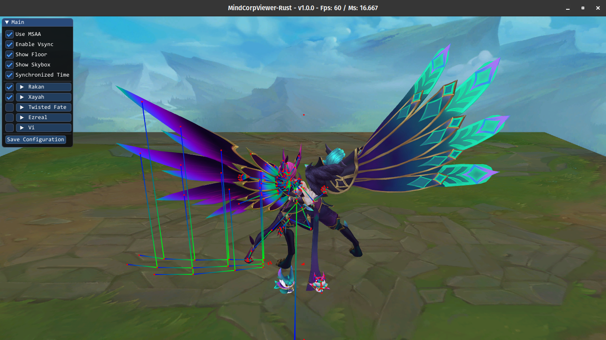

# MindCorpViewer-Rust
League Of Legends Model Viewer Using Rust

## Help From:
* https://github.com/Querijn/LeagueModel
* https://github.com/CommunityDragon/CDTB
* https://github.com/LoL-Fantome/LeagueToolkit

## How to use: 
* Step 1: Download mindcorpviewer-rust_"your system"
* Step 2: Extract skn, skl, dds files and animations folder with: https://github.com/Crauzer/Obsidian
* Step 3: Add model in program or modify the config.json

